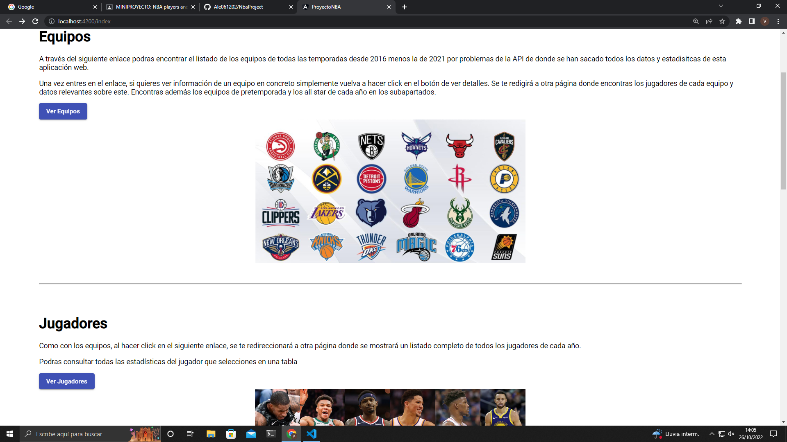
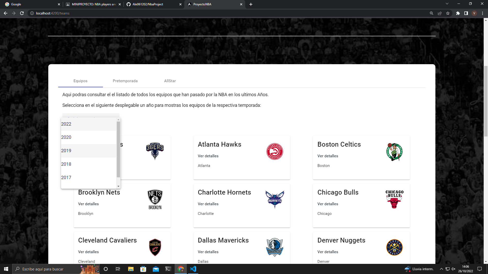
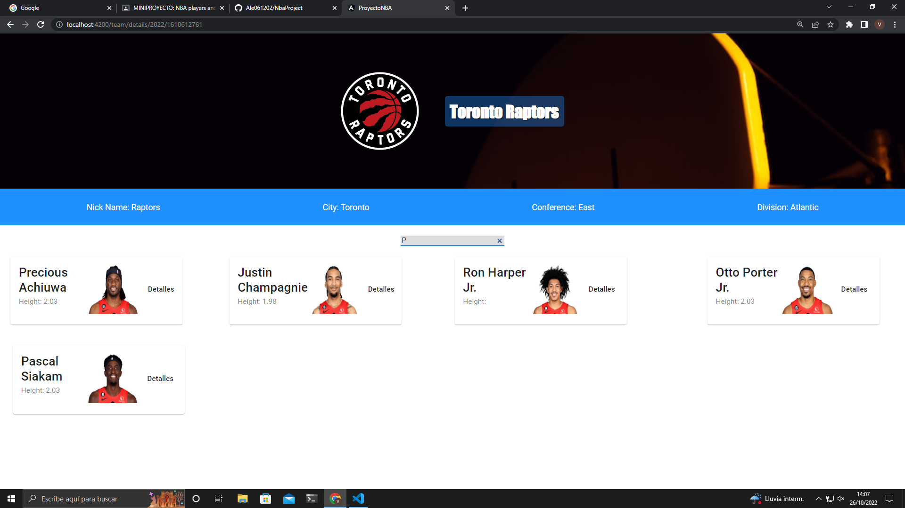
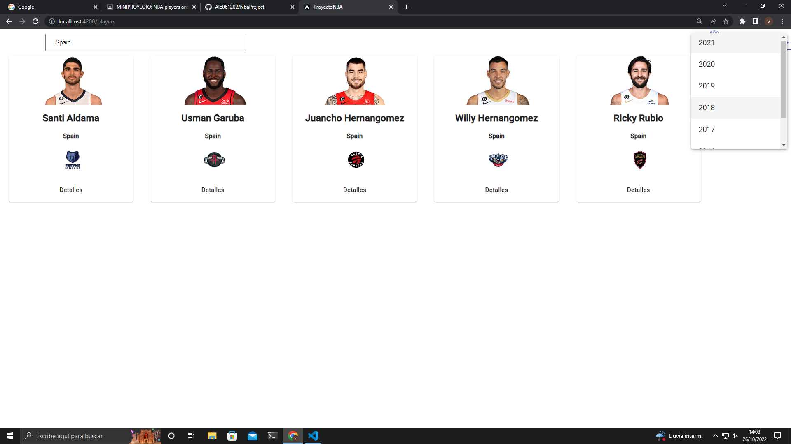
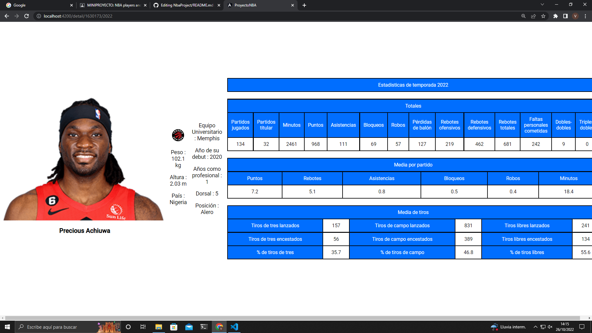
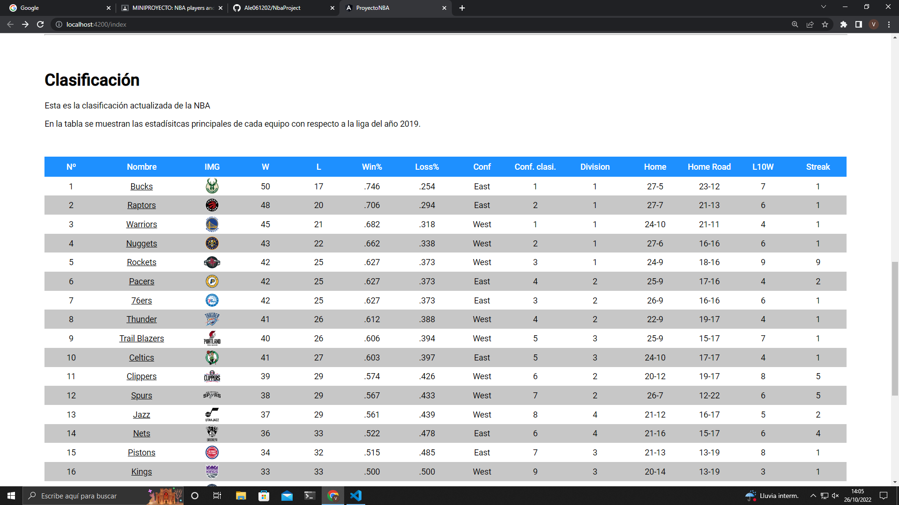

# NbaProject

# Descripción:

En este proyecto hemos usado una API de la NBA en la que hemos implementado varios endpoints que proceden de la API, en la que esta hemos implementado principalmente la lista de jugadores y equipos, después de realizar dichas listas hemos añadido un endpoint más, que este es una tabla clasificatoria de los equipos, también hemos hecho los detalles de cada lista principal ( jugadores y equipos ), en la que hemos añadido un filtro en el que los jugadores cuando quieras buscar sera a traves de los países de origen del jugador y en la lista equipos hemos añadido un buscar por el nombre y apellido.

# Realizado por:

Alejandro Fernandez Gomez-Caminero: https://github.com/Ale061202

Víctor González Carro: https://github.com/gcvictor22

# Menu principal:

Podras ir al menu de jugadores y equipos

# Equipos

Puedes seleccionar el año desde 2016 para ver los equipos

# Detalles equipos

Puedras ver detalles del equipo y buscar por nombre o apellido el nombre de estos

# Jugadores

Aqui encontraras todos los jugadores y podras filtrar por año y por nombre del país

# Detalles jugador

Se mostraran las estadísticas de cada jugador al hacer click en el botón que aparece bajo la tarjeta

# Clasificación

Podras ver la clasificacion de 2019 aqui, mostrando los datos más relevantes de todos los equipos de la nba.

